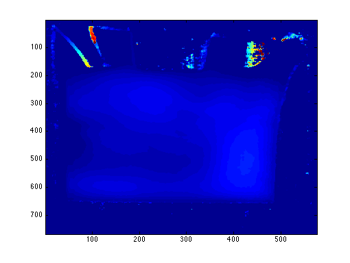
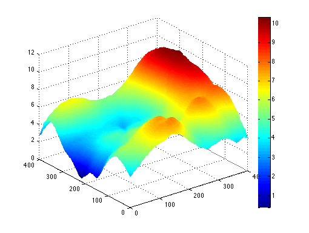

Title
=====
Palmprint Recognition with 3-D Features

Objectives
==========
In this paper, I will find features for authentication in the existing 3-D palmprint database. The features shall be stable in samples of a single person over time and distinguishable among samples of different people.

An identification process based on the features will be proposed.

The process will go through 8,000 samples in the database to be checked for stability and error rate.

Content
=======
(Innovative features, challenge, academic value and applicability of the project)

Palmprint has been increasingly recognized as a unique and stable biometric characteristics for personal authentication. In the past decade, various methods based on two dimensional (2-D) palmprint have been studied in depth. The 2-D recognition techniques have proved to achieve high accuracy [2].

In recent years, three dimensional (3-D) palmprint recognition devices emerge and are quite promising because of the additional depth information gathered.

Although the devices has been out for more than two years, most previous matching algorithms treat 3-D information as a supplement to 2-D texture images and used joint matching techniques to increase accuracy [1,5,6,7,8]. Authentication with only the 3-D information has not been thoroughly studied. The amount of useful information carried by the 3-D data is still under investigation.

There are two major challenges:

* 3-D devices, compared to 2-D ones, are lower in resolution.
* The depth values are susceptible to movements of human hands and are therefore less stable than 2-D texture information of palmprints.

Existing work has been done to utilize the 3-D information for palmprint classification and sorting. The global features proposed for that purpose are fast in matching speed but low in accuracy compared to 2-D techniques.

The major contribution of this paper would be a set of features that can increase the recognition performance of palmprint verification.

Methodology
===========
The idea is to extract one or more features from the 3-D information as classifiers. Together with existing classifiers found in existing work in related fields [3,4,9], the new features will be combined to achieve a high performance classifier for personal authentication using Support Vector Machine (SVM).

The sample data has already been collected. There are 8,000 samples from 400 different palms with both hands. Samples of a palm are collected in two separate sessions with an average interval of one month.

")

Experiments will be done using Matlab.

1. Extract features from each palmprint sample.
2. A subset of samples will be chosen as test set.
3. Train a authentication model based on the rest of samples.
4. Verify the samples in the test set with the trained model against their true identities.
5. Discuss the performance of the model. 

References
==========

[1]	W. Li, D. Zhang, L. Zhang, G. Lu, and J. Yan, “3-d palmprint recognition with joint line and orientation features,” *Systems, Man, and Cybernetics, Part C: Applications and Reviews, IEEE Transactions on*, no. 99, pp. 1–6, 2011.

[2]	A. Kong, D. Zhang, and M. Kamel, “A survey of palmprint recognition,” *Pattern Recognition*, vol. 42, no. 7, pp. 1408–1418, 2009.

[3]	C. Xu, Y. Wang, T. Tan, and L. Quan, “Automatic 3d face recognition combining global geometric features with local shape variation information,” in *Automatic face and gesture recognition, 2004. Proceedings. Sixth IEEE international conference on*, pp. 308–313, Ieee, 2004.

[4]	P. Yan and K. Bowyer, “Biometric recognition using 3d ear shape,” *Pattern Analysis and Machine Intelligence, IEEE Transactions on*, vol. 29, no. 8, pp. 1297–1308, 2007.

[5]	W. Li, L. Zhang, D. Zhang, G. Lu, and J. Yan, “Efficient joint 2d and 3d palmprint matching with alignment refinement,” in *Computer Vision and Pattern Recognition (CVPR), 2010 IEEE Conference on*, pp. 795–801, IEEE, 2010.

[6]	D. Zhang, G. Lu, W. Li, L. Zhang, and N. Luo, “Palmprint recognition using 3-d information,” *Systems, Man, and Cybernetics, Part C: Applications and Reviews, IEEE Transactions on*, vol. 39, no. 5, pp. 505–519, 2009.

[7]	D. Zhang, V. Kanhangad, N. Luo, and A. Kumar, “Robust palmprint verification using 2d and 3d features,” *Pattern Recognition*, vol. 43, no. 1, pp. 358–368, 2010.

[8]	D. Zhang, G. Lu, W. Li, L. Zhang, and N. Luo, “Three dimensional palmprint recognition using structured light imaging,” in *Biometrics: Theory, Applications and Systems, 2008. BTAS 2008. 2nd IEEE International Conference on*, pp. 1–6, IEEE, 2008.

[9]	C. Samir, A. Srivastava, and M. Daoudi, “Three-dimensional face recognition using shapes of facial curves,” *Pattern Analysis and Machine Intelligence, IEEE Transactions on*, vol. 28, no. 11, pp. 1858–1863, 2006.

Scheduled programme of work
=========================
* Feb 15 - Feb 29: Literature review of existing features of all kinds of 3-D data.
* Mar 1 - Mar 31: Verification of stability and discrimination of features proposed.
* Apr 1 - Apr 30: Build the model with Matlab. Start the experiment on the palmprint database.
* May 1 - May 31: Write the paper and finish the experiment. 
* Jun 1 - Jun 15: Revise the paper.

Description of facilities required and justification
====================================================
(Also detail any other supporting facilities obtained elsewhere)

N/A